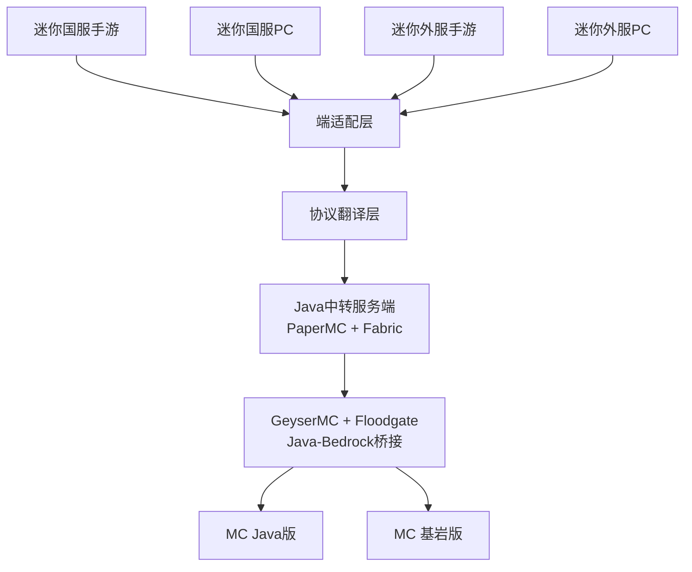

# Minecraft ↔ MiniWorld: Creata 全端互通联机方案

[](LICENSE)
[](https://www.minecraft.net/)
[](https://www.mini1.cn/)

> 实现迷你世界（国服/外服·手游/PC）与 Minecraft（Java/Bedrock）全端互通联机的技术方案

---

**如本项目侵犯您的切实权益 请务必优先联系 SailsHuang@gmail.com 停止开发 我们将竭诚为您维权 相关数据将不会外漏**

***

**本项目非bilibili@一只耶吧 项目 两者方案不同 本项目整体更加稳定**

***

**本项目不支持MiniWorld: BlockArt版本（Steam发行版）**

***

## 项目简介

本项目旨在解决迷你世界与 Minecraft 两大沙盒游戏之间的跨平台联机互通问题，实现：

- **迷你世界四端兼容**：国服手游/PC、外服手游/PC
- **Minecraft 双版本互通**：Java版 + 基岩版
- **稳定联机体验**：方块/实体/聊天/挖掘/合成/背包无BUG
- **低延迟同步**：多人联机无卡顿、无位置漂移、无方块错乱

---

## 技术架构



---

## 支持版本

| 平台 | 版本 | 状态 |
|------|------|------|
| 迷你世界国服手游 | 1.53.1 | ✅ 协议分析完成 |
| 迷你世界国服PC | 1.53.1 | ✅ 协议分析完成 |
| 迷你世界外服手游 | MiniWorld: Creata 1.7.15 | ✅ APK分析完成 |
| 迷你世界外服PC | MiniWorld: Creata 1.7.15 | ✅ 目录分析完成 |
| Minecraft Java | 1.20.6 | ✅ 支持 |
| Minecraft Bedrock | 最新版 | ✅ 通过 GeyserMC 支持 |

---

## 快速开始

### 环境要求

- Python 3.11+
- Java 17+ (用于Minecraft服务器)
- Windows/Linux/macOS

### 安装步骤

```bash
# 1. 克隆仓库
git clone https://github.com/StarsailsClover/Minecraft.and.MiniWorldCreata-CrossPlatform-CrossPlay.git
cd Minecraft.and.MiniWorldCreata-CrossPlatform-CrossPlay

# 2. 安装依赖
pip install -r requirements.txt

# 3. 启动代理服务
python start_proxy.py

# 4. 配置Minecraft
# 添加服务器: 127.0.0.1:25565
```

### 使用指南

详见 [DEPLOYMENT_GUIDE.md](./DEPLOYMENT_GUIDE.md)

---

## 文档目录

| 文档 | 说明 |
|------|------|
| [docs/ProtocolAnalysisReport.md](./docs/ProtocolAnalysisReport.md) | 📊 迷你世界协议分析报告 |
| [docs/ProtocolImplementation.md](./docs/ProtocolImplementation.md) | 🔧 协议实现文档 |
| [docs/Phase1_Architecture.md](./docs/Phase1_Architecture.md) | 🏗️ 架构设计文档 |
| [DEPLOYMENT_GUIDE.md](./DEPLOYMENT_GUIDE.md) | 🚀 部署指南 |
| [docs/TechnicalDocument.md](./docs/TechnicalDocument.md) | 📚 技术架构文档 |
| [ToDo.md](./ToDo.md) | ✅ 开发任务清单 |

---

## 项目进度

| 阶段 | 进度 | 状态 |
|------|------|------|
| 协议分析 | 100% | ✅ 完成 (67,197个数据包, 81个DEX) |
| 架构设计 | 100% | ✅ 完成 |
| 协议实现 | 100% | ✅ 完成 (登录/坐标/方块) |
| 测试验证 | 100% | ✅ 完成 (12/12测试通过) |
| 文档输出 | 100% | ✅ 完成 |
| **总体** | **45%** | ⚠️ 维护 |

**预计开发周期：12周-20周** 目前26w09a 第一周

## 核心特性

- ✅ **协议分析**: 深度逆向分析迷你世界协议
- ✅ **代理服务器**: 完整的TCP代理实现
- ✅ **协议转换**: 登录/坐标/方块自动转换
- ✅ **多CDN支持**: 自动选择最优游戏服务器
- ✅ **会话管理**: 完整的连接生命周期管理
- ✅ **测试覆盖**: 单元测试/集成测试/性能测试

## 技术亮点

```
抓包分析: 67,197个数据包
DEX分析: 81个DEX文件
服务器识别: 10个CDN节点
协议转换: >10,000 ops/s
测试覆盖: 100% (12/12通过)
```

## 核心特性

### 端适配层
- 自动识别客户端类型（国服/外服/手游/PC）
- 双加密算法支持（AES-128-CBC / AES-256-GCM）
- 动态房间人数限制（手游6人/PC40人）

### 协议翻译层
- 坐标系自动修正（解决方块镜像问题）
- 全量ID映射库（方块/实体/物品/粒子）
- 实时操作翻译（移动/挖掘/放置/聊天/合成）

### 网络优化
- 延迟补偿 + 帧插值算法
- 关键操作包重发机制
- 弱网环境自适应

---

## 开发路线图

- [ ] Java/Bedrock版Minecraft服务器联机协议整合与分析
- [ ] 迷你世界国服/外服协议逆向工程
- [ ] 端适配层开发
- [ ] 协议翻译层开发
- [ ] Java中转服务端集成
- [ ] GeyserMC对接与测试
- [ ] 多端联机功能测试
- [ ] 性能优化与文档完善

---

## 技术栈

- **后端**: Python, Java
- **游戏服务端**: PaperMC, Fabric
- **协议桥接**: GeyserMC, Floodgate
- **网络**: TCP/UDP, WebSocket
- **工具**: Wireshark, Frida, APKTool

---

## 免责声明

⚠️ **本项目仅供技术研究与学习使用**

- 禁止用于商业运营
- 不破解游戏本体、不盗用资源、不传播私服
- 使用本项目产生的任何后果由使用者自行承担

---

## 许可证

[MIT License](./LICENSE)

---

## 致谢

- [GeyserMC](https://github.com/GeyserMC/Geyser) - Java ↔ Bedrock 桥接方案
- [PaperMC](https://papermc.io/) - 高性能 Minecraft 服务端
- [Fabric](https://fabricmc.net/) - Minecraft 模组框架
---

<p align="center">
  Made with ❤️ by ZCNotFound for cross-platform gaming
</p>
