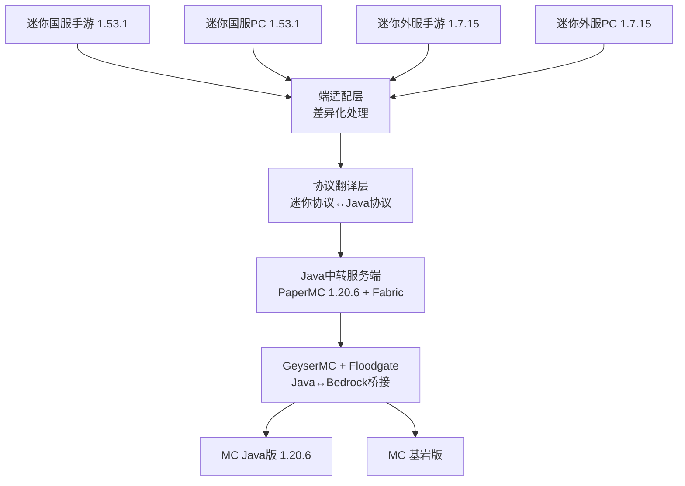

<!-- 
此文档已脱敏处理
处理时间: 2026-02-28T13:37:25.579312
原始文件: README.md
-->

# MnMCP - Minecraft ↔ MiniWorld: Creata 全端互通联机方案

<p align="center">
  
</p>

<p align="center">
  <a href="LICENSE"></a>
  <a href="https://www.minecraft.net/"></a>
  <a href="https://[数据处理字符:12]/"></a>
  <a href=".github/workflows/ci.yml"></a>
</p>

> 实现迷你世界（国服/外服·手游/PC）与 Minecraft（Java/Bedrock）全端互通联机的技术方案

>[访问MnMCP官方网站](https://starsailsclover.github.io/MnMCP) MnMCP共建者社区Q群：1084172731

**如果我们的项目侵犯了您的切实权益，请联系SailsHuang@gmail.com并提供依据，我们竭诚为您维权。不必担心您的权益内容被泄露，我们采用加密算法对一些可能侵权的信息进行加密，仅使用时可被程序翻译。**

---

## 我们不建议使用该版本(26w09aC) 出现了重大漏洞
### 漏洞等级：FunctionError 001，重要功能缺陷
漏洞编码：26w09aC-EC2603011210, Phase 1, Step A, FormalVersion

涵盖版本：Dev Step 0.0.1-v 0.3.1_26w09a (26w09aC)
### 请您等候紧急修复（预计3-4周）更新
由于方案发生了颠覆性变化 下一个大版本更新将推送MnMCP 2.0 正式版本号前缀为v 1.0.0 预计开发周期3-4周 
### 届时可实现
Streamer开房、Server开房/翻译、Personal接入房间

---

## 📋 项目简介

**MnMCP** (Minecraft and MiniWorld Creata Cross-Platform Cross-Play) 是一个实现 Minecraft Java版 与 迷你世界 跨平台联机的代理服务器项目。

基于 bilibili@一只耶吧 原方案的缺陷分析，本项目采用全新架构和方案：
**迷你四端** → **端适配层** → **协议翻译层** → **Java中转服务端** → **GeyserMC** → **MC全端**

同时我们开发[BlockConnect技术](https://github.com/StarsailsClover/BlockConnect)，实现任何游戏与minecraft的互通联机。

---

## ✨ 功能特性

- 🎮 **全端互通** - 迷你世界（国服/外服·手游/PC）↔ Minecraft（Java/Bedrock）
- 🔄 **协议翻译** - 自动转换 Minecraft 和 迷你世界 协议
- 🧱 **方块同步** - 支持29+种方块的双向同步（持续扩展中）
- 💬 **聊天转发** - 实时聊天消息互通
- 🏃 **移动同步** - 玩家位置和动作同步
- 🔐 **加密支持** - 支持国服/外服加密协议
- 📊 **实时监控** - 数据包捕获和分析
- ⚡ **高性能** - 基于 asyncio 的异步架构

---

## 📊 项目状态

| 阶段 | 状态 | 进度 |
|------|------|------|
| 架构设计 | ✅ 完成 | 100% |
| 协议分析 | ✅ 完成 | 100% |
| CI/CD | ✅ 完成 | 100% |
| 方块映射 | 🟡 进行中 | 30%（等待运行时验证） |
| 登录认证 | 🟡 框架完成 | 40% |
| 代理服务器 | 🟡 框架完成 | 50% |

---

## 🏗️ 技术架构



---

## 📁 项目结构

```
Minecraft.and.MiniWorldCreata-CrossPlatform-CrossPlay/
├── 📁 docs/                          # 技术文档
│   ├── TechnicalDocument.md         # 技术架构文档
│   ├── ProjectPlan.md               # 项目规划与开发计划
│   ├── PROTOCOL_ANALYSIS_REPORT.md  # 协议分析报告
│   └── ...
├── 📁 src/                           # 源代码
│   ├── core/                        # 核心模块
│   │   ├── proxy_server.py         # 代理服务器
│   │   ├── protocol_translator.py  # 协议翻译器
│   │   └── session_manager.py      # 会话管理器
│   └── protocol/                    # 协议处理
│       ├── block_mapper.py         # 方块映射
│       ├── miniworld_auth.py       # 迷你世界认证
│       ├── login_handler.py        # 登录处理
│       └── coordinate_converter.py # 坐标转换
├── 📁 tools/                         # 工具集
│   ├── android_shell/              # Android工具
│   ├── jadx/                       # APK反编译
│   └── MiniWorld_BlockID_Extraction_Package/  # 方块ID提取包
├── 📁 .github/workflows/            # CI/CD配置
│   └── ci.yml                      # GitHub Actions工作流
├── 📄 README.md                     # 本文件
├── 📄 PROJECT_OVERVIEW.md           # 项目总览
├── 📄 BeforeDevelopment.md          # 开发前必读
└── 📄 COMPONENT_MANIFEST.json       # 组件清单
```

---

## 🚀 快速开始

### 系统要求

- **操作系统**: Windows 10/11, Linux, macOS
- **Python**: 3.11 或更高版本
- **Minecraft**: Java版 1.20.6
- **迷你世界**: PC版 1.53.1

### 安装步骤

```bash
# 1. 克隆仓库
git clone https://github.com/yourusername/Minecraft.and.MiniWorldCreata-CrossPlatform-CrossPlay.git
cd Minecraft.and.MiniWorldCreata-CrossPlatform-CrossPlay

# 2. 安装依赖
pip install -r requirements.txt

# 3. 运行组件检查
python check_and_fix_components.py

# 4. 启动代理服务器（开发模式）
python -m src.core.proxy_server --dev
```

---

## 📚 文档索引

| 文档 | 说明 |
|------|------|
| [BeforeDevelopment.md](BeforeDevelopment.md) | 开发前必读，项目结构说明 |
| [PROJECT_OVERVIEW.md](PROJECT_OVERVIEW.md) | 项目总览和核心功能模块 |
| [docs/TechnicalDocument.md](docs/TechnicalDocument.md) | 技术架构详细文档 |
| [docs/ProjectPlan.md](docs/ProjectPlan.md) | 项目规划与风险分析 |
| [docs/PROTOCOL_ANALYSIS_REPORT.md](docs/PROTOCOL_ANALYSIS_REPORT.md) | 协议分析报告 |
| [docs/NextSteps.md](docs/NextSteps.md) | 下一步行动计划 |

---

## 🔧 支持版本

| 平台 | 版本 | 状态 |
|------|------|------|
| 迷你世界国服手游 | 1.53.1 | ✅ 协议分析完成 |
| 迷你世界国服PC | 1.53.1 | ✅ 协议分析完成 |
| 迷你世界外服手游 | MiniWorld: Creata 1.7.15 | ✅ APK分析完成 |
| 迷你世界外服PC | MiniWorld: Creata 1.7.15 | ✅ 目录分析完成 |
| Minecraft Java | 1.20.6 | ✅ 目标版本 |
| Minecraft Bedrock | 最新版 | ✅ 通过GeyserMC支持 |

---

## 🤝 贡献指南

1. Fork 本仓库
2. 创建特性分支 (`git checkout -b feature/AmazingFeature`)
3. 提交更改 (`git commit -m 'Add some AmazingFeature'`)
4. 推送到分支 (`git push origin feature/AmazingFeature`)
5. 打开 Pull Request

---

## 📄 许可证

本项目采用 MIT 许可证 - 详见 [LICENSE](LICENSE) 文件

---

## 🙏 致谢

- [GeyserMC](https://github.com/GeyserMC/Geyser) - Java↔Bedrock互通桥接
- [PaperMC](https://papermc.io/) - 高性能Minecraft服务端
- [Floodgate](https://github.com/GeyserMC/Floodgate) - 基岩版玩家身份映射
- [Yeah114](https://github.com/Yeah114) - 方块映像参考列表制作者
- [xphorror](https://github.com/xphorror) - 迷你世界层开发技术支持
- [X1LinBaka](https://github.com/按要求保密) - 心跳矫正技术支持
- [CuO](https://github.com/Soldier11-ObsidianBarracks) - 方块映像技术支持
- [BlackMoss](https://github.com/Black-Moss) - [flutter](https://flutter.dev/)开发支持

---

<p align="center">
  <b>MnMCP</b> - 让不同世界的玩家能够一起游戏 By ZCNotFound❤️
</p>
