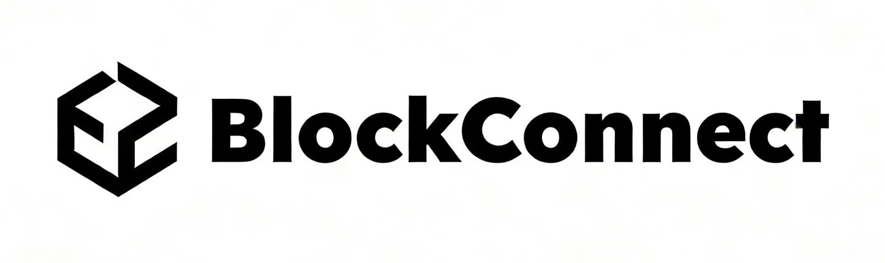
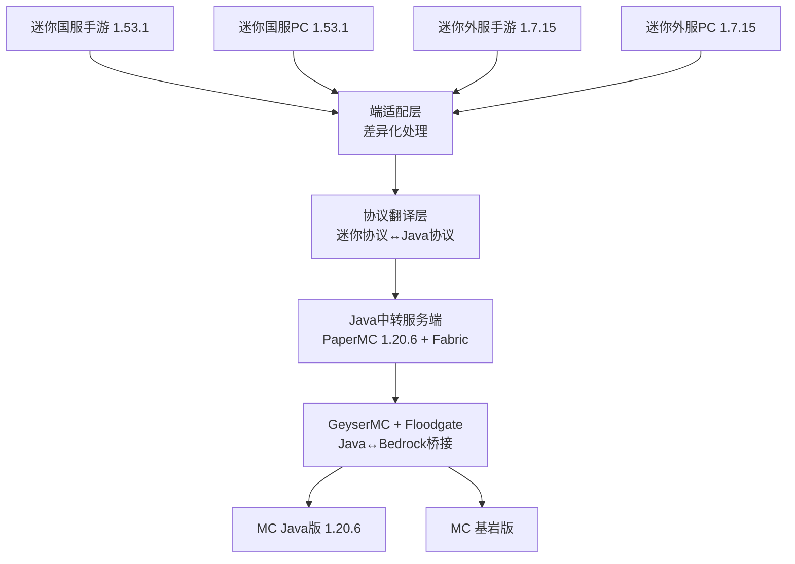

<!-- 
此文档已脱敏处理
处理时间: 2026-02-28T13:37:25.579312
原始文件: README.md
-->

# MnMCP - Minecraft ↔ MiniWorld: Creata 全端互通联机方案

<p align="center">
  
</p>

<p align="center">
  <a href="LICENSE"></a>
  <a href="https://www.minecraft.net/"></a>
  <a href="https://www.mini1.cn/"></a>
  
  
  
  <a href=".github/workflows/ci.yml"></a>
</p>

> 实现迷你世界（国服/外服·手游/PC）与 Minecraft（Java/Bedrock）全端互通联机的技术方案

>[访问MnMCP官方网站](https://starsailsclover.github.io/MnMCP) MnMCP共建者社区Q群：1084172731

**如果我们的项目侵犯了您的切实权益，请联系SailsHuang@gmail.com并提供依据，我们竭诚为您维权。不必担心您的权益内容被泄露，我们采用加密算法对一些可能侵权的信息进行加密，仅使用时可被程序翻译。**

---
## 该版本是开发版本 可能不稳定
---

## 📋 项目简介

**MnMCP** (Minecraft and MiniWorld Creata Cross-Platform Cross-Play) 是一个实现 Minecraft Java版 与 迷你世界 跨平台联机的代理服务器项目。

基于 bilibili@一只耶吧 原方案的缺陷分析，本项目采用全新架构和方案：
**迷你四端** → **端适配层** → **协议翻译层** → **Java中转服务端** → **GeyserMC** → **MC全端**

同时我们开发[BlockConnect技术](https://github.com/StarsailsClover/BlockConnect)，实现任何游戏与minecraft的互通联机。

---

## ✨ 功能特性

- 🎮 **全端互通** - 迷你世界（国服/外服·手游/PC）↔ Minecraft（Java/Bedrock）
- 🔄 **协议翻译** - 自动转换 Minecraft 和 迷你世界 协议
- 🧱 **方块同步** - 支持29+种方块的双向同步（持续扩展中）
- 💬 **聊天转发** - 实时聊天消息互通
- 🏃 **移动同步** - 玩家位置和动作同步
- 🔐 **加密支持** - 支持国服/外服加密协议
- 📊 **实时监控** - 数据包捕获和分析
- ⚡ **高性能** - 基于 asyncio 的异步架构

---

## 📊 项目状态

| 阶段 | 状态 | 进度 |
|------|------|------|
| 架构设计 | ✅ 完成 | 100% |
| 协议分析 | ✅ 完成 | 100% |
| CI/CD | ✅ 完成 | 100% |
| 方块映射 | 🟡 进行中 | 30%（等待运行时验证） |
| 登录认证 | 🟡 框架完成 | 40% |
| 代理服务器 | 🟡 框架完成 | 50% |

---

## 🏗️ 技术架构



---

## 📁 项目结构

```
├── mnmcp-core/          # Python 核心协议引擎
│   ├── src/mnmcp/
│   │   ├── protocol/    # MC/MNW 协议定义与翻译
│   │   ├── mapping/     # 方块/实体/物品/坐标映射
│   │   ├── crypto/      # AES 加密 (CBC/GCM)
│   │   ├── network/     # 代理服务器/中继/会话
│   │   ├── physics/     # 游戏算法差异处理
│   │   └── utils/       # 配置/日志
│   ├── data/            # 映射数据 (2969 方块映射)
│   ├── tests/           # pytest 测试 (17/17 通过)
│   └── pyproject.toml   # 标准 Python 包
│
├── mnmcp-shared/        # Flutter 共享组件库
│   └── lib/
│       ├── models/      # Player, Room, ConnectionConfig
│       ├── protocol/    # Dart 端协议翻译
│       ├── services/    # 连接/协议服务
│       ├── widgets/     # TitleBar, StatusIndicator, LogViewer
│       └── utils/       # 统一主题/常量
│
├── mnmcp-personal/      # 玩家客户端 (Flutter + Kotlin)
│   ├── lib/             # Dart UI
│   └── android/         # Kotlin VPN Service
│
├── mnmcp-streamer/      # 房主客户端 (Flutter + Kotlin)
│   ├── lib/             # Dart UI
│   └── android/         # Kotlin 前台服务
│
├── mnmcp-server/        # 服务器管理面板 (Flutter)
│   └── lib/             # 房间管理/玩家管理/日志
│
└── mnmcp-website/       # 官网 + 文档站
```

---

## 🚀 快速开始

### 核心引擎 (Python)

```bash
cd mnmcp-core
pip install -e ".[dev]"
pytest  # 运行测试
```

### 客户端 (Flutter)

```bash
# 需要 Flutter SDK >= 3.0
cd mnmcp-personal  # 或 mnmcp-streamer / mnmcp-server
flutter pub get
flutter run -d windows  # Windows 桌面
flutter build apk       # Android
```

## 技术栈

| 层 | 技术 |
|---|------|
| 核心引擎 | Python 3.11+, asyncio, websockets, cryptography |
| 协议 | MC Bedrock (RakNet/VarInt), MNW (Protobuf over TCP) |
| 加密 | AES-128-CBC (国服), AES-256-GCM (外服) |
| 客户端 | Flutter/Dart (Windows + Android) |
| 原生层 | Kotlin (VPN Service, 前台服务) |
| 映射数据 | 2969 方块 + 实体 + 物品 (JSON) |


---

## 三种使用角色

| 角色 | 应用 | 说明 |
|------|------|------|
| **玩家** | mnmcp-personal | 连接到已有房间，最简单 |
| **房主** | mnmcp-streamer | 创建房间让别人加入 |
| **服务器** | mnmcp-server | 部署公共中继服务器 |

## 开发状态

- [x] 核心协议引擎 (mnmcp-core)
- [x] 方块/实体/物品映射 (2969+)
- [x] AES 加密 (CBC + GCM)
- [x] 统一代理服务器
- [x] Flutter 客户端框架
- [x] Android Kotlin 原生层
- [ ] 完整的 MNW Protobuf 解析
- [ ] 端到端联机测试
- [ ] iOS 支持
---

## 🔧 支持版本

| 平台 | 版本 | 状态 |
|------|------|------|
| 迷你世界国服手游 | 1.53.1 | ✅ 协议分析完成 |
| 迷你世界国服PC | 1.53.1 | ✅ 协议分析完成 |
| 迷你世界外服手游 | MiniWorld: Creata 1.7.15 | ✅ APK分析完成 |
| 迷你世界外服PC | MiniWorld: Creata 1.7.15 | ✅ 目录分析完成 |
| Minecraft Java | 1.20.6 | ✅ 目标版本 |
| Minecraft Bedrock | 最新版 | ✅ 通过GeyserMC支持 |

---

## 🤝 贡献指南

1. Fork 本仓库
2. 创建特性分支 (`git checkout -b feature/AmazingFeature`)
3. 提交更改 (`git commit -m 'Add some AmazingFeature'`)
4. 推送到分支 (`git push origin feature/AmazingFeature`)
5. 打开 Pull Request

---

## 📄 许可证

本项目采用 MIT 许可证 - 详见 [MIT License](LICENSE)

---

## 🙏 致谢

- [GeyserMC](https://github.com/GeyserMC/Geyser) - Java↔Bedrock互通桥接
- [PaperMC](https://papermc.io/) - 高性能Minecraft服务端
- [Floodgate](https://github.com/GeyserMC/Floodgate) - 基岩版玩家身份映射
---
- [Yeah114](https://github.com/Yeah114) - 方块映像参考列表制作者（即使已经弃用）
- [CuO](https://github.com/Soldier11-ObsidianBarracks) - 方块映像技术支持
- [BlackMoss](https://github.com/Black-Moss) - [Flutter](https://flutter.dev/)开发支持
---
- [xphorror](https://github.com/xphorror) - 迷你世界层开发技术支持
- [X1LinBaka](https://github.com/) - 心跳矫正技术支持
- [Maan](https://github.com/) - 跨平台开发工程师
- [Alex_Pan](https://github.com/Higheritech) - 人工智能提示词工程师

---
## 免责声明

本项目仅用于技术研究和学习目的。Minecraft 是 Mojang Studios 的商标，迷你世界是深圳市迷你玩科技有限公司的商标。本项目与上述公司无关。

---

<p align="center">
  <b>MnMCP</b> - 让不同世界的玩家能够一起游戏 By ZCNotFound❤️
</p>


