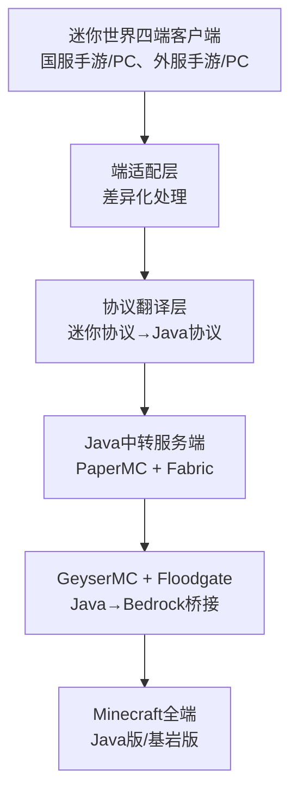
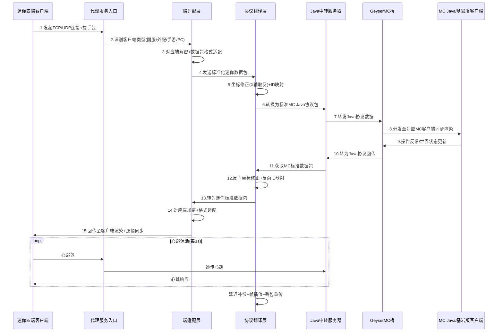

# 迷你世界（国服/外服·手游/PC）↔ Minecraft（Java/Bedrock）全端互通联机方案
## 技术架构与实现文档

---

## 1. 文档概述

### 1.1 项目目标
基于初中生「迷你世界国服手游 ↔ MC基岩版」原型，**修复缺陷、补齐短板、扩展兼容**，最终实现：
- 迷你世界：**国服手游/PC、外服手游/PC 四端全兼容**
- Minecraft：**Java版 + 基岩版 双版本互通**
- 稳定联机：方块/实体/聊天/挖掘/合成/背包无BUG
- 可迭代：支持游戏版本更新、协议加密变更
- 低延迟：多人联机无卡顿、无位置漂移、无方块错乱

### 1.2 基准版本锁定
| 端类型 | 选定版本 | 选择理由 |
|--------|----------|----------|
| 迷你国服手游 | 1.53.1 | 用户量最大、协议最稳定、原型已验证 |
| 迷你国服PC | 1.53.1 | 与手游同大版本，协议核心一致，仅同步逻辑差异 |
| 迷你外服手游 | MiniWorld: Creata 1.7.15 | 与国服玩法同源，仅登录/加密/方块ID差异 |
| 迷你外服PC | MiniWorld: Creata 1.7.15 | 外服全端同步，适配海外网络与账号体系 |
| Minecraft Java | 1.20.6 | GeyserMC兼容最优、模组生态成熟、性能稳定 |
| Java→基岩桥 | GeyserMC + Floodgate | 官方级Java↔Bedrock互通方案 |
| Java服务端 | PaperMC 1.20.6 | 高并发、抗卡顿、适合中转层 |

---

## 2. 整合后整体技术架构

### 2.1 核心架构图


### 2.2 分层技术细节

#### 2.2.1 端适配层（四端差异化核心）
- **子模块**：客户端类型识别、加解密适配、房间人数限制、数据包裁剪/补全
- **国服**：迷你号/手机号登录、AES-128-CBC加密、手游6人/PC40人
- **外服**：Google/FB OAuth登录、AES-256-GCM加密、海外网络优化
- **手游**：精简数据包、低流量适配、弱网容错
- **PC**：完整同步字段、高帧率同步、大房间逻辑

#### 2.2.2 协议翻译层（核心中枢）
- **子模块**：数据包解析、坐标修正、ID映射、操作指令翻译、校验和重构
- 强制X轴取反（解决方块镜像）
- 国服/外服双ID映射表（方块/实体/物品/粒子）
- 迷你操作 → MC标准操作（挖掘/放置/移动/聊天/合成）

#### 2.2.3 Java中转层
- 基于PaperMC：异步IO、抗卡顿、高并发
- Fabric加载器：轻量、易扩展、兼容Geyser
- 统一协议出口：屏蔽迷你四端差异，对外呈现标准MC Java客户端

#### 2.2.4 互通桥层
- GeyserMC：Java → 基岩版协议无损转换
- Floodgate：基岩版玩家免Java账号登录、跨端身份映射

### 2.3 多端联机全时序流程图


### 2.4 多端联机流程细化

#### 阶段1：连接建立
1. 迷你四端客户端 → 代理服务器：发送版本号+设备类型+登录凭证
2. 代理识别：国服/外服、手游/PC，分配对应适配规则
3. 建立双链路：客户端↔代理、代理↔Java中转服务器

#### 阶段2：数据上行（玩家操作同步）
1. 客户端操作（移动/挖方块/聊天）→ 加密数据包
2. 端适配层：解密 → 裁剪/补全数据包 → 标准化
3. 协议翻译层：X坐标取反 → 方块/实体ID映射 → 转为MC Java包
4. 经Geyser转发至MC Java/基岩版所有客户端

#### 阶段3：数据下行（世界状态同步）
1. MC服务器广播世界更新（方块变化/玩家移动/生物刷新）
2. 协议翻译层：反向ID映射 → 坐标还原 → 生成迷你数据包
3. 端适配层：按客户端类型加密 → 回传对应迷你客户端
4. 客户端渲染：无错位、无漂移、无延迟

#### 阶段4：保活与容错
- 1s心跳包：检测连接存活，自动重连
- 丢包重传：关键操作（挖方块、放置）必达
- 延迟插值：弱网下平滑移动，不瞬移

---

## 3. 协议桥核心代码框架

```python
import socket
import json
import threading
import time

# ======================== 配置常量 ========================
MINI_VERSION_CN = "1.53.1"
MINI_VERSION_EN = "1.7.15"
MC_JAVA_VERSION = "1.20.6"
JAVA_SERVER_HOST = "127.0.0.1"
JAVA_SERVER_PORT = 25565

# 方块ID映射表（国服/外服分开）
BLOCK_MAPPING_CN = {1: 5, 2: 1, 3: 17}
BLOCK_MAPPING_EN = {1: 5, 2: 1, 4: 17}

# ======================== 端适配模块 ========================
class MiniClientAdapter:
    def __init__(self, client_type: str):
        self.client_type = client_type
        self.max_players = 6 if "mobile" in client_type else 40
        self.block_mapping = BLOCK_MAPPING_CN if "cn" in client_type else BLOCK_MAPPING_EN
        self.encrypt_method = "AES-128-CBC" if "cn" in client_type else "AES-256-GCM"

    def adapt_packet(self, packet: bytes) -> bytes:
        decrypted = self._decrypt(packet)
        adapted = self._simplify_or_expand(decrypted)
        return self._encrypt(adapted)

    def _decrypt(self, packet: bytes) -> bytes: return packet # 待逆向填充
    def _encrypt(self, packet: bytes) -> bytes: return packet
    def _simplify_or_expand(self, packet: bytes) -> bytes: return packet

# ======================== 协议翻译模块 ========================
class ProtocolTranslator:
    def __init__(self, adapter: MiniClientAdapter):
        self.adapter = adapter

    def mini_to_mc(self, mini_packet: bytes) -> bytes:
        data = json.loads(mini_packet.decode(errors="ignore"))
        if "position" in data: data["position"]["x"] = -data["position"]["x"]
        if "block_id" in data: data["block_id"] = self.adapter.block_mapping.get(data["block_id"], 0)
        return json.dumps(data).encode()

    def mc_to_mini(self, mc_packet: bytes) -> bytes:
        data = json.loads(mc_packet.decode(errors="ignore"))
        if "position" in data: data["position"]["x"] = -data["position"]["x"]
        reverse_map = {v:k for k,v in self.adapter.block_mapping.items()}
        if "block_id" in data: data["block_id"] = reverse_map.get(data["block_id"], 0)
        return json.dumps(data).encode()

# ======================== 代理服务器 ========================
class MiniMCProxy:
    def __init__(self, host="0.0.0.0", port=8888):
        self.host = host
        self.port = port
        self.running = False

    def start(self):
        self.running = True
        self.s = socket.socket(socket.AF_INET, socket.SOCK_STREAM)
        self.s.setsockopt(socket.SOL_SOCKET, socket.SO_REUSEADDR, 1)
        self.s.bind((self.host, self.port))
        self.s.listen(10)
        print(f"代理启动：{self.host}:{self.port}")
        while self.running:
            cli, addr = self.s.accept()
            adapter = MiniClientAdapter("cn_mobile")
            trans = ProtocolTranslator(adapter)
            threading.Thread(target=self._handle, args=(cli, trans), daemon=True).start()

    def _handle(self, cli, trans):
        mc_sock = socket.socket()
        mc_sock.connect((JAVA_SERVER_HOST, JAVA_SERVER_PORT))
        def fwd_mini2mc():
            while self.running:
                data = cli.recv(4096)
                if not data: break
                adapted = trans.adapter.adapt_packet(data)
                mc_data = trans.mini_to_mc(adapted)
                mc_sock.sendall(mc_data)
        def fwd_mc2mini():
            while self.running:
                data = mc_sock.recv(4096)
                if not data: break
                mini_data = trans.mc_to_mini(data)
                cli.sendall(mini_data)
        threading.Thread(target=fwd_mini2mc, daemon=True).start()
        threading.Thread(target=fwd_mc2mini, daemon=True).start()

if __name__ == "__main__":
    MiniMCProxy().start()
```

---

## 4. 多端联机验证要点

### 4.1 必验清单
1. 迷你四端均可单独连接MC Java/基岩版
2. 四端混合联机无卡顿、无闪退
3. 方块无镜像、无错位、ID映射正确
4. 移动/挖掘/放置/聊天/合成全正常
5. 弱网下无漂移、无丢包、自动重连

### 4.2 测试环境要求
- 迷你国服/外服测试账号各2个
- MC Java/基岩版测试账号各2个
- 本地PaperMC + Fabric + GeyserMC + Floodgate环境
- Wireshark抓包工具

---

## 相关文档

- [项目规划与开发计划](./ProjectPlan.md) - 包含开发步骤、风险分析、研究规划
